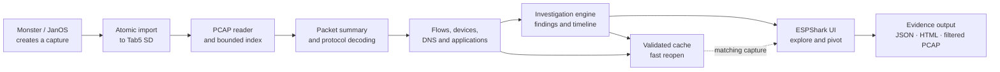
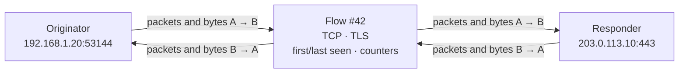
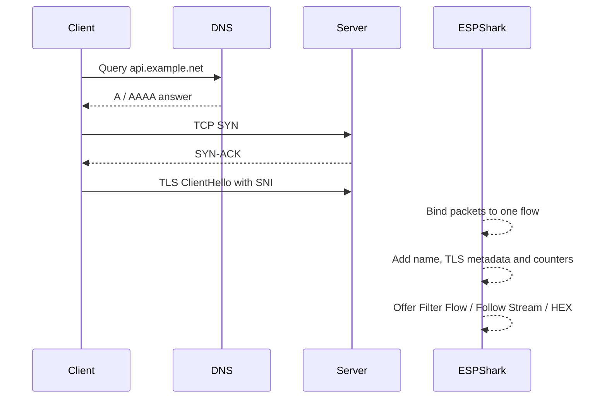
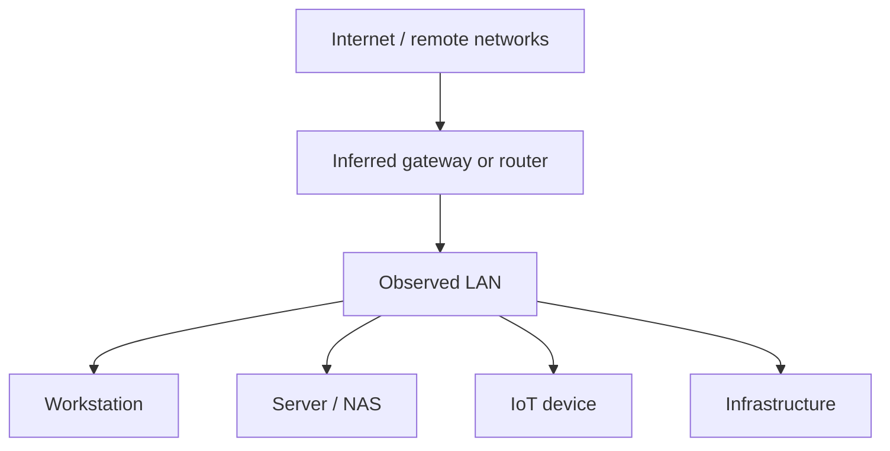
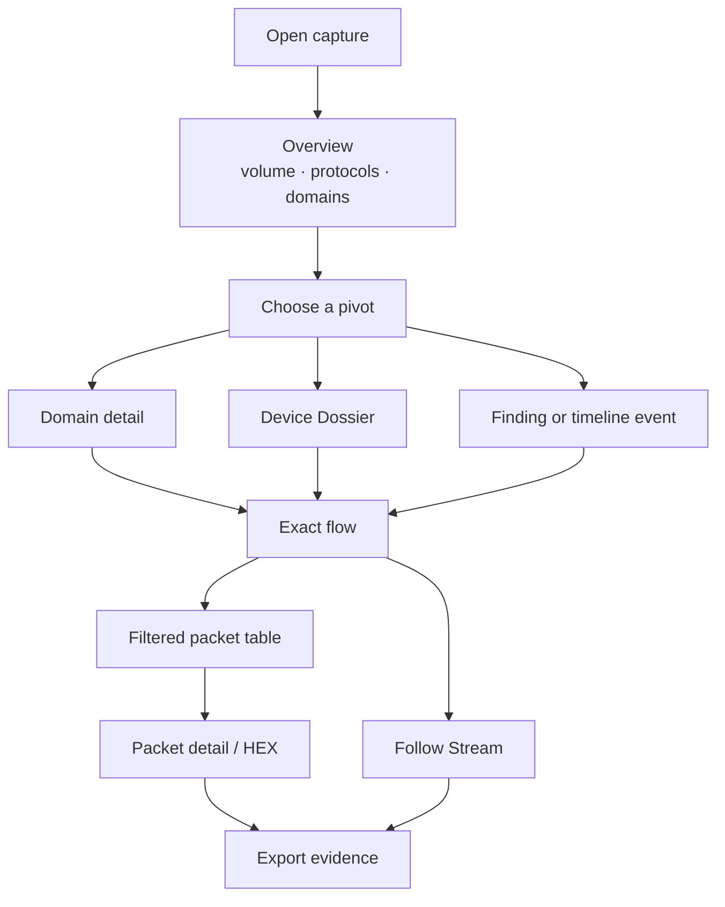

# ESPShark

## Offline packet investigation for M5Stack Tab5

> **Capture on Monster. Investigate on Tab5. Keep the evidence local.**

ESPShark is an offline-first PCAP investigation environment designed for the
M5Stack Tab5. It turns packet captures into a navigable view of conversations,
devices, names, services, applications, network relationships, and security
evidence without requiring a cloud service or an Internet connection.

It is not intended to reproduce every feature of Wireshark or Zeek on an
embedded device. Its purpose is different: provide the most useful field
investigation workflow on a touchscreen, within predictable CPU, memory, and
storage limits.

---

## 1. What ESPShark is

ESPShark combines five jobs in one interface:

1. **Capture manager** — imports captures from Monster/JanOS or opens captures
   already stored on the Tab5 SD card.
2. **Packet browser** — indexes packets and presents protocol, source,
   destination, length, timing, and decoded details.
3. **Conversation analyzer** — groups packets into bidirectional flows and
   derives application, timing, quality, and metadata.
4. **Network explorer** — builds device, DNS, service, and inferred-topology
   views that can be opened and filtered interactively.
5. **Investigation workspace** — correlates findings with packets, flows,
   devices, domains, and a chronological evidence timeline.

The result is a workflow closer to an investigator's notebook than a packet
dump: every summary should lead back to the traffic that supports it.

### At a glance

| Area | What ESPShark provides |
|---|---|
| Capture library | Monster import, Tab5 SD library, atomic local writes |
| Packet decoding | Ethernet, Wi-Fi, IEEE 802.15.4, IPv4/IPv6, TCP/UDP, and common application protocols |
| Packet table | Pagination, protocol filters, address/port/flow/application pivots, packet detail, HEX |
| Name visibility | DNS, mDNS, TLS SNI, HTTP Host, hostname hints, optional FQDN labels in the traffic table |
| Conversations | Bidirectional flows, direction counters, timing, TCP quality, application confidence |
| Follow Stream | Bounded ASCII or HEX reconstruction with gaps and truncation made visible |
| Devices | Local/remote inventory, aliases, peers, services, domains, risk and evidence |
| Network map | Inferred hierarchy plus traffic, threat, and service graph modes |
| Security | Explainable alerts and investigation findings with evidence packet references |
| Comparison | Save a known-good baseline and compare later captures |
| Extracted objects | Plaintext HTTP file carving with SHA-256, manifest and explicit COMPLETE/GAPS/PARTIAL/TRUNCATED state |
| Evidence output | JSON report, standalone HTML report, filtered PCAP, filter profiles, analysis cache |

---

## 2. Design principles

### Offline first

Packet contents, hostnames, findings, and reports can remain on the device.
Core analysis does not depend on remote DNS, cloud reputation, or an online
threat-intelligence service.

### Evidence before verdicts

ESPShark describes what it observed and why a rule fired. A finding is a lead
for investigation, not proof that a device is compromised.

### Bounded operation

Every major analysis structure has a fixed maximum size. Large captures remain
usable because ESPShark reports partial coverage explicitly instead of silently
consuming unbounded memory.

### Touch-first navigation

The normal operation is a sequence of pivots: tap a domain, device, endpoint,
service, finding, or flow and move directly to the relevant evidence.

### Deterministic and repeatable

The same capture and the same local rules produce the same analysis. Cached
results are tied to the capture identity and analysis schema.

---

## 3. End-to-end architecture



The capture file remains the source of truth. Summaries, maps, device roles,
name hints, and findings are derived views that help reach the underlying
packet or flow.

---

## 4. ESPShark Hub and capture lifecycle

ESPShark starts in a central hub with two primary paths:

- **Read from Monster** lists captures exposed by the connected Monster/JanOS
  device and copies the selected file to the Tab5.
- **Open from Tab5** opens a classic-PCAP capture already available in the local
  SD-card library.

Transfers use a temporary `.part` file and promote it only after a successful
download. A cancelled or interrupted transfer therefore does not masquerade as
a complete capture. Local indexes, caches, and exports use the same general
principle: write a temporary file, finish and validate it, then rename it.

When a capture opens, ESPShark can reuse a compatible analysis cache. If the
capture identity, cache schema, size, or integrity checks do not match, it
rebuilds the analysis from the PCAP.

---

## 5. Capture formats and link layers

ESPShark reads **classic PCAP 2.4** files with:

- little-endian or big-endian headers;
- microsecond or nanosecond timestamp variants;
- safe validation of packet lengths and truncated records.

Supported link-layer types include:

| Link type | Value | Typical content |
|---|---:|---|
| Ethernet | 1 | Wired or normalized LAN traffic |
| IEEE 802.11 | 105 | Native Wi-Fi frames and management traffic |
| IEEE 802.15.4 without FCS | 230 | Low-rate wireless personal-area traffic |
| IEEE 802.15.4 TAP | 283 | 802.15.4 frames with TAP metadata |

PCAPNG is detected and rejected with a clear unsupported-format message rather
than being parsed as classic PCAP.

### Protocol coverage

Depending on the link layer and available bytes, ESPShark recognizes or
extracts information from:

- Ethernet, VLAN, ARP, IPv4, IPv6, ICMP and ICMPv6;
- TCP and UDP, including ports, flags, sequence information and payload sizes;
- DNS, mDNS, LLMNR, NBNS and DHCP;
- HTTP, TLS, QUIC, SSDP, NTP, SSH, FTP, Telnet, SMB, MQTT, SMTP, IMAP, POP3,
  RDP, VNC, RTSP, CoAP, Redis, common databases, BitTorrent and BitTorrent DHT;
- EAPOL and selected IEEE 802.11 management frames;
- basic IEEE 802.15.4 addressing and frame information.

Recognition can come from port numbers, packet signatures, or parsed protocol
metadata. ESPShark records how strong that conclusion is instead of presenting
every port-based guess as a certainty.

---

## 6. The packet table

The packet table is the evidence-level view of the capture. Each indexed row
contains the relative timestamp, protocol, source, destination, concise packet
information, and captured length.

Available protocol views include:

- all traffic;
- DNS, TCP, UDP, HTTP, TLS, ARP and EAPOL;
- IEEE 802.11 management traffic;
- malformed or incomplete packets.

Filter tabs include matching packet counts. The table is paginated so the UI
does not need to create thousands of touchscreen objects at once.

### Quick filters

A packet, flow, device, domain, endpoint, or graph node can create a focused
view using one or more of these dimensions:

- IP address or MAC address;
- TCP/UDP port;
- exact bidirectional flow;
- detected application;
- relative time window.

Selecting a row opens decoded packet details and the raw HEX view. This is also
the final verification step for higher-level findings.

---

## 7. Hostnames and `SHOW FQDN`

IP addresses are precise but often difficult to recognize. `SHOW FQDN` adds a
name hint above an exact `IP:port` endpoint in the main traffic table while
keeping the original address visible underneath.

ESPShark learns these hints offline from evidence already present in the
capture:

- DNS and mDNS A/AAAA answers;
- TLS ClientHello SNI;
- HTTP `Host` headers;
- other locally decoded host aliases where available.

DNS responses can contribute multiple A/AAAA addresses, including more than one
address from the same response. DNS carried over TCP is handled when enough
bounded payload is available. Flow-specific TLS SNI or HTTP Host metadata is
preferred when it gives stronger context than a global address-to-name mapping.

The number of indexed packets with at least one available name hint is shown in
the interface. If no usable mapping exists for the currently visible endpoints,
the table remains unchanged and ESPShark reports that no FQDN hints are
available for that view.

> **Important:** a name hint is contextual evidence, not permanent ownership of
> an IP address. CDNs, shared hosting, proxies, NAT, short DNS TTLs, and encrypted
> name resolution can make one address represent many names.

---

## 8. Overview and DNS exploration

The Overview summarizes the capture before the investigator chooses a pivot.
It presents volume, timing, dominant protocols, endpoints, ports, and domain
activity without requiring a full packet-by-packet review.

### Interactive Top Domains

Top Domains is not only a frequency list. Selecting a domain opens a focused
view that can show:

- which local clients requested it;
- which IPv4 or IPv6 addresses were returned;
- which related flows appeared in the capture;
- packet, filtering, Follow Stream, and HEX pivots where applicable.

This makes questions such as “who contacted this name?” or “what traffic
followed this DNS answer?” answerable from the touchscreen.

---

## 9. What a flow is

A **packet** is one observed frame. A **flow** is ESPShark's bidirectional record
of a conversation between two endpoints.

For TCP and UDP, a flow is principally identified by:

```text
IP address A + port A + IP address B + port B + transport protocol
```

Both directions belong to the same flow. ESPShark normalizes the endpoint pair
and, where the packet evidence permits, identifies an **originator** and a
**responder**. A TCP SYN/SYN-ACK handshake is strong orientation evidence;
mid-stream captures may require a best-effort orientation.



A flow can accumulate:

- first and last packet numbers and timestamps;
- packet, byte, and payload-byte counters for each direction;
- TCP flags, handshake observations and an approximate RTT;
- retransmission and zero-window indicators;
- detected application and confidence;
- server name from TLS SNI, HTTP Host, or related name evidence;
- application metadata such as HTTP request information, TLS parameters, or a
  BitTorrent info hash.

### Application confidence

ESPShark distinguishes three useful confidence levels:

| Confidence | Meaning |
|---|---|
| Transport | Only the underlying TCP/UDP conversation is known |
| Likely | Port or contextual evidence suggests an application |
| Confirmed | Payload structure or parsed metadata confirms the protocol |

This separation matters. Traffic on port 443 is not automatically proven to be
TLS, and traffic on an unusual port can still be confirmed as TLS from its
ClientHello.

---

## 10. Connections and Follow Stream

The Connections view lists the largest or most relevant flows and exposes
direction, endpoints, names, application, confidence, timing, packet counts,
bytes, and TCP-quality observations.

From a flow, the investigator can:

- filter the packet table to that exact conversation;
- open the packets supporting the flow;
- inspect decoded metadata and raw bytes;
- open **Follow Stream**.

### Follow Stream

Follow Stream reconstructs a bounded, ordered view of TCP payload segments. It
supports ASCII and HEX output and annotates what it cannot reconstruct cleanly,
including:

- sequence gaps;
- retransmissions or overlaps;
- missing capture data;
- output truncation caused by the embedded safety limit.

The result is intentionally described as a reconstruction aid, not a complete
TCP implementation. It is especially useful for HTTP headers, plaintext
credentials, banners, requests, commands, and other small application
exchanges. Encrypted TLS payload remains encrypted.



---

## 11. Application intelligence

The Applications view aggregates flows by detected application rather than by
individual packet. It helps answer “what kinds of network activity happened?”
before drilling into a specific conversation.

Examples include:

- DNS, mDNS, DHCP, HTTP, TLS and QUIC;
- SSDP, NTP, LLMNR and NBNS;
- SSH, FTP, Telnet, SMB, RDP and VNC;
- MQTT, CoAP, RTSP and Redis;
- SMTP, IMAP and POP3;
- BitTorrent and BitTorrent DHT;
- generic TCP, UDP, ICMP, ARP, EAPOL and Wi-Fi management traffic.

Where the payload is visible, ESPShark can enrich an application with details
such as:

- HTTP method, target, status and Host;
- TLS SNI, ALPN, advertised version, cipher/extension characteristics and a
  compact ClientHello fingerprint;
- BitTorrent info hash;
- indicators of credential-bearing plaintext.

These fields are stored on the relevant flow so they remain available in
Connections, Device Dossier, DNS exploration, findings, and reports.

---

## 12. Device inventory and Device Dossier

The Devices view converts endpoints into a working inventory. IPv4 and IPv6
observations can be merged when a usable MAC address links them to the same
device. Remote Internet endpoints remain separate from local devices.

Depending on the evidence, a device record can include:

- MAC, IPv4 and IPv6 aliases;
- observed hostname and DNS names;
- local or remote classification;
- first and last activity;
- bytes and packets sent and received;
- observed services and listening-side ports;
- communication peers and domains;
- inferred role, risk score, findings and evidence packets;
- optional vendor information from a local offline OUI database.

Selecting a device opens **Device Dossier**, a consolidated summary that links
back to its flows and packets. It is intended to answer the practical question:
“What is this device, what did it do, and why should I care?”

---

## 13. Network map

ESPShark provides four complementary map modes:

| Mode | Primary question |
|---|---|
| Topology | How might the observed local network be organized? |
| Traffic | Which nodes exchanged the most traffic? |
| Threats | Which nodes are associated with alerts or findings? |
| Services | Where were notable services observed? |

### Inferred topology

The Topology mode presents a UniFi-inspired hierarchy:



The hierarchy is derived from packet evidence such as address relationships,
MAC activity, hostnames, observed services, external communication, and peer
patterns. It is **not** a discovery of the physical cabling, switch ports,
wireless association tree, or actual forwarding path.

Roles such as gateway, infrastructure, server, IoT, and LAN client are
best-effort classifications. The UI labels the view **INFERRED FROM PCAP** to
keep that distinction visible.

Selecting a node updates its summary and provides direct actions to:

- open Device Dossier;
- filter the packet table to the selected node;
- inspect related flows, services, findings, and evidence.

Tapping an observed host opens **Host Quick View** directly above the map. It
shows identity, role, directional traffic counters, services, alerts and—when a
local dossier is available—risk, findings, aliases, peers, and DNS/SNI context.
The same view provides one-tap filters for all host traffic, exact source or
destination traffic, and the host combined with an observed service port. Its
five largest retained flows expose `FILTER`, `FOLLOW`, and `HEX` actions without
requiring a separate trip through the Connections list.

The topology uses a vertical, scrollable hierarchy. Internet, the inferred
gateway, and the logical L2 fabric form a central backbone; local devices are
placed in a framed one- or two-column list with fixed spacing. Traffic, Threats,
and Services use separate vertical LAN and WAN lanes so node labels do not
collapse into the circular-layout collisions common on a small display.

Traffic, Threats, and Services retain a graph-oriented view with weighted edges
and context-specific node emphasis. Together, the modes show both a readable
network hierarchy and the relationships that do not fit into a tree.

---

## 14. Network health and security alerts

The analysis engine looks for observable patterns that deserve attention. Its
alert families include:

- port scanning and host sweeping;
- ARP conflicts;
- unusual DNS behavior;
- beacon-like repeated communication;
- possible large outbound transfer;
- cleartext administrative services;
- worm-like spreading patterns;
- excessive broadcast traffic;
- weak TLS observations;
- TCP quality problems such as retransmissions or zero-window behavior.

An alert carries severity, confidence, source or target context, counters, and
bounded evidence packet references. This allows the UI and exported reports to
explain why it appeared.

Network-quality indicators and security-relevant indicators share the same
evidence model but should not be confused: poor TCP quality is a diagnostic
observation, not an intrusion verdict.

---

## 15. Offline Investigation workspace

The Investigation workspace correlates raw analyzer alerts with broader,
operator-friendly findings. It can surface conditions such as:

- exposed administrative services and external access to them;
- cleartext IoT or management protocols;
- multiple DHCP servers;
- LLMNR/NBNS name-poisoning exposure;
- suspicious DNS patterns or encrypted-DNS candidates;
- SMB1, cleartext MQTT, or Wi-Fi deauthentication bursts;
- IOC IP or domain matches;
- locally forbidden ports;
- credential exposure in visible plaintext.

Findings are linked to devices, flows, packets, domains, and a chronological
timeline wherever the capture provides that relationship.

### Local rules and IOCs

The investigation model is designed to remain useful offline. Local rule and
IOC files can add environment-specific IP addresses, domains, or forbidden
services without submitting capture contents to an external provider.

---

## 16. Baseline comparison

A trusted capture can be saved as a **known-good baseline**. A later capture can
then be compared against it to identify changes such as:

- new or missing local devices;
- newly contacted remote endpoints or domains;
- added or removed observed services;
- shifts in the visible network profile.

A baseline is not a security guarantee. It is a compact answer to “what changed
since the network looked normal?” and a fast way to prioritize investigation.

---

## 17. The investigation flow

ESPShark is designed around progressive narrowing rather than a single static
dashboard.



A typical field workflow is:

1. Import or open the capture.
2. Check the Overview for dominant protocols, endpoints, and domains.
3. Inspect the inferred Topology or Devices list to identify the relevant host.
4. Open Device Dossier and select a peer, domain, service, or finding.
5. Narrow to an exact flow.
6. Use Follow Stream for readable payload or open the supporting packets and
   HEX bytes.
7. Export a filtered PCAP or report that preserves the evidence trail.

The investigator can also begin from the opposite direction: open a severe
finding, inspect its evidence packets, then work outward to the flow and device.

---

## 18. Reports, exports, and persistence

ESPShark can produce or persist several kinds of artifact:

| Artifact | Purpose |
|---|---|
| Analysis cache | Reopens a matching capture without repeating all analysis |
| JSON report | Machine-readable summary, flow, device, alert, and investigation data |
| Standalone HTML report | Portable human-readable report with embedded data |
| Filtered classic PCAP | Evidence subset matching the active packet/quick filters |
| Filter profile | Reusable set of address, port, flow, application, or time constraints |
| Baseline | Compact known-good network state for later comparison |

The current internal schemas are versioned independently: analysis cache
schema **7**, report schema **6**, and filter-profile schema **2**. Readers
reject incompatible data rather than interpreting it using the wrong layout.

JSON and HTML exports should still be treated as derived reports. The original
PCAP remains the authoritative evidence file.

---

## 19. Extracted objects

`EXTRACT FILES` reconstructs the files that actually travelled through a
capture. It rebuilds the server-to-client byte stream of plaintext HTTP/1.x
conversations and writes every response body it can bound to the SD card.

**This is carving, not decryption.** HTTPS, QUIC, SSH and VPN payloads stay
encrypted; those conversations are counted as `encrypted flow(s)` and produce no
file. A capture that starts in the middle of a download has no response header
to bound the object, so it is skipped rather than guessed at.

### How it works

Extraction runs only when asked, never on capture open. It then makes two passes
over the **whole** capture, independent of the 4,096-record ceiling used by the
packet table:

1. **Discovery** walks every record, recognizes HTTP sessions from a request
   line or an `HTTP/1.` response, remembers each request's method, URL and
   `Host`, and records a descriptor for every server-to-client payload segment.
2. **Carving** sorts those descriptors by TCP sequence, trims retransmissions,
   makes gaps explicit, and feeds the resulting byte stream into an HTTP state
   machine that writes each response body straight to disk.

Body boundaries come from `Content-Length`, `Transfer-Encoding: chunked`, or
connection close. Responses that carry no body—`1xx`, `204`, `304`, and answers
to `HEAD`—are recognized as such, and a successful `CONNECT` ends the session
because what follows is a TLS tunnel.

### Result states

Every object carries an explicit state rather than an implied success:

| State | Meaning |
|---|---|
| `COMPLETE` | Every declared body byte was present in the capture |
| `GAPS` | Missing TCP bytes were zero-filled to preserve file offsets |
| `PARTIAL` | The stream ended, or framing was lost, before the body did |
| `TRUNCATED` | The 4 MiB per-object ceiling was reached |

Confidence compares the declared `Content-Type` against the validated magic
bytes: `HIGH` when they agree, `MEDIUM` when only one identifies the type,
`MISMATCH` when they disagree, and `LOW` when neither does. The file extension
follows the **detected** type, not the server's claim.

### Output and safety

Objects land in `/sdcard/lab/espshark/objects/<capture>/` next to a
`manifest.json` recording the 5-tuple, packet range, URL and `Host`, declared
and detected type, size, gap bytes, SHA-256, state and confidence. Each file is
written to `*.part`, hashed while writing, `fsync`ed, and only then renamed—so
an interrupted run leaves a recognizable partial file, never a false
`COMPLETE`. Re-running replaces that directory's contents.

The source PCAP is only ever read. `DELETE` removes the derived copy alone.

Extracted files are untrusted input. `PREVIEW` shows bounded text with safe
character encoding, renders HTML as source rather than as a live page, and
falls back to hex for images, archives and unknown formats. Nothing is executed
or unpacked on the device.

---

## 20. Embedded limits and honest partial results

ESPShark is intentionally resource-bounded. Current principal limits include:

| Structure | Maximum |
|---|---:|
| Indexed packets | 4,096 |
| Flows | 512 |
| Follow Stream segments | 256 |
| Follow Stream rendered output | 24 KiB |
| Devices | 128 |
| Services per device | 12 |
| DNS address-to-name mappings | 128 |
| A/AAAA addresses retained from one DNS response | 4 |
| Security alerts | 64 |
| Evidence packets per alert | 6 |
| Investigation findings | 96 |
| Timeline events | 128 |
| Graph nodes | 48 |
| Graph edges | 128 |
| Devices shown in the topology hierarchy | 12 |
| DNS detail clients | 16 |
| DNS detail addresses | 16 |
| DNS detail related flows | 24 |
| Extracted objects | 64 |
| Extracted HTTP sessions | 48 |
| Extracted stream segments | 16,384 |
| Bytes per extracted object | 4 MiB |
| Bytes per extraction run | 32 MiB |
| Zero-filled gap inside one object | 256 KiB |

When a limit is reached, ESPShark uses visible states such as **LIMITED**,
**TRUNCATED**, or **INCOMPLETE**. These are part of the trust model: absence from
a partial view must not be interpreted as absence from the original capture.

---

## 21. What ESPShark cannot prove

Packet analysis is limited by the capture itself. Important boundaries include:

- traffic not present in the PCAP cannot be reconstructed;
- a short capture is only a sample of network behavior;
- switched, routed, NATed, or monitor-mode capture points see different traffic;
- encrypted application payload remains unavailable without decryption keys;
- ESPShark does not currently perform TLS or WPA session decryption;
- object extraction only recovers plaintext HTTP/1.x, never HTTPS, HTTP/2 or HTTP/3;
- encrypted DNS reduces the names observable from traditional DNS packets;
- topology and device roles are inferred, not physically discovered;
- one IP address can represent many FQDNs and one FQDN can resolve to many IPs;
- heuristic findings can produce false positives and false negatives;
- classic PCAP is supported, while PCAPNG is not parsed;
- bounded tables can represent only the reported portion of a very large capture;
- offline operation does not automatically add current Internet reputation data.

ESPShark should therefore be used to preserve observations, form testable
hypotheses, and find supporting packets—not to replace professional judgment.

---

## 22. Main implementation components

| Component | Responsibility |
|---|---|
| `pcap_reader` | Classic-PCAP validation, record access, full-file iteration and link-layer decoding |
| `pcap_summary` | Capture-level counts, endpoints, ports, DNS and Wi-Fi summaries |
| `pcap_flow` | Flows, applications, devices, names, streams and security alerts |
| `pcap_investigation` | Findings, timeline, baseline diff, local IOC/rule correlation |
| `pcap_analysis_store` | Versioned cache and report persistence |
| `pcap_extract` | TCP stream reassembly, HTTP object carving, hashing and manifest |
| ESPShark UI | Hub, tables, pivots, dossiers, graphs, Follow Stream, objects and exports |

This separation keeps the analysis model independent from the screen that
presents it. A UI action selects or filters existing evidence; it does not
silently redefine what the analyzer observed.

---

## 23. Glossary

| Term | Meaning in ESPShark |
|---|---|
| Packet | One captured frame or packet record |
| Endpoint | An address, usually combined with a TCP/UDP port |
| Flow | A normalized bidirectional conversation between two endpoints |
| Originator | The endpoint that appears to have initiated a flow |
| Responder | The endpoint that appears to have answered the originator |
| FQDN hint | A hostname associated with an address or flow from capture evidence |
| Application | The best available classification of a flow's higher-level protocol |
| Device | A correlated local or remote host identity derived from observed addresses |
| Finding | An investigation lead supported by analyzer evidence or a local rule |
| Baseline | A saved known-good network profile used for later comparison |
| Pivot | Moving from one entity—such as a domain—to its related flows or packets |

---

## ESPShark in one sentence

**ESPShark turns an offline PCAP into a touchscreen investigation path from
network overview, through names, devices and conversations, down to the exact
packets that support the conclusion.**
