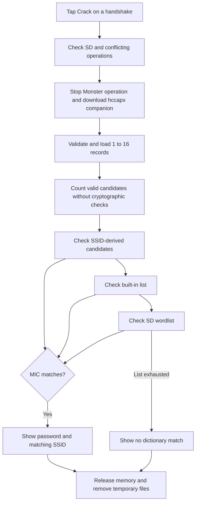

# On-device handshake dictionary check

In **Handshakes**, tap **Crack** next to a capture. Tab5 downloads its `.hccapx`
companion from the selected Monster using the serial transport, then checks it
locally on the ESP32-P4. Insert a Tab5 SD card first. The companion must already
exist on the Monster; this operation does not convert a PCAP on Tab5.

You can also use **Scan → select network(s) → Handshaker**. After the capture
operation finishes successfully, **Crack latest** appears next to **Send to
wpa-sec**. It closes the capture monitor and starts the same checker for the
last file path reported by `PCAP saved:` or `HCCAPX saved:`. If several networks
were selected, this shortcut checks the most recently reported file. If older
firmware reports success without a usable path, the shortcut opens the Handshakes
list so you can select the file explicitly. It does not guess filenames from SSIDs.

Create `/lab/wordlist.txt` at the root of the **Tab5 SD card**. Put one passphrase
per line, with no heading or comments. Use plain text without a BOM. LF and CRLF
line endings work. Passphrases must be 8–63 bytes; spaces are preserved. Empty,
oversized and binary lines are skipped as whole lines. A final newline is optional.

The checker tries SSID-derived candidates first, then the built-in common list and the SD
dictionary. If the file is absent, the result says that only the built-in list and
SSID guesses were used. An unreadable dictionary is reported as an error.

The GUI status identifies the active source: **Generic (built-in)**,
**SSID variants**, or **SD: /lab/wordlist.txt**. The prefix is **Counting** during
the initial enumeration and **Checking** during password verification. It changes
at each source transition, before processing that source's first candidate.
When a password is found, the result also shows which source supplied it.

Before checking passwords, Tab5 counts valid candidates using the same enumeration
and line parser as the actual check. The SD dictionary is read twice; it is never
loaded into RAM as a whole. Do not edit or replace the dictionary during a run.

The popup shows tried/total candidates, measured candidates per second, average
seconds per candidate, a percentage bar and estimated remaining time. **Cancel**
stops the download or checking task, then becomes **Close**. Cancellation can wait
for the current candidate's cryptographic calculation. The temporary companion
and partial download are removed when the task ends. Found passwords appear in
the popup and are not saved automatically.

Supported input: 1–16 complete [hccapx v4 records](https://hashcat.net/wiki/doku.php?id=hccapx),
WPA/TKIP (key version 1) and WPA2 (key version 2). PMKID-only captures, key version
3, raw 64-digit PSKs and nonce correction are not implemented. Invalid, unsupported,
truncated or oversized companion files are rejected, rather than reported as an
exhausted dictionary. A failed dictionary check does not establish password strength.

## End-to-end flow



Errors and cancellation also lead to cleanup. A match ends the entire run: the
checker does not continue searching for additional passwords or networks.

### 1. Select and transfer

`hs_crack_file_cb()` takes the selected remote PCAP path and opens the mode dialog.
Choose Single or Dual, then Start. The coordinator replaces `.pcap` with `.hccapx` and downloads that companion
through `janos_uart_download()`. This is a separate operation from **Copy to Tab5**.

The transport is the selected Monster connection (M-BUS UART or the USB serial
transport). The checker does not upload the capture to a cloud service or use
Wi-Fi to test each password. After downloading, the password checks are offline.

The temporary file is `/sdcard/lab/handshakes/_crack_tmp.hccapx`. The transfer may
also create `_crack_tmp.hccapx.part`; both are removed when the worker finishes.
The `/sdcard` prefix is the firmware mount point, not a directory to create at the
root of the physical card.

A log such as `Saved ... (393 bytes, CRC32 ..., 0 retried block(s))` confirms a
completed transfer of one record. The CRC32 checks transfer integrity; it does
not establish that a password was found or that the capture is usable.

### 2. Validate the capture

Each packed hccapx record is 393 bytes and supplies the information needed for a
candidate check:

| Field | Purpose |
| --- | --- |
| Signature and version | Identify hccapx version 4 |
| SSID bytes and length | Salt for password-to-PMK derivation |
| AP and station MAC addresses | Inputs to key derivation |
| AP and station nonces | Inputs to key derivation |
| Key descriptor version | Select HMAC-MD5 or HMAC-SHA1 for the MIC |
| Captured MIC | Expected 16-byte result |
| EAPOL frame and length | Message authenticated with the derived key |

`hs_crack_load_records()` checks record boundaries and calls
`hs_crack_record_valid()`. Validation includes the signature, version, message-pair
range, SSID length, supported key version, EAPOL length/type and key-version
consistency. A partial trailing record or more than 16 records rejects the file.
This validation checks structure; a structurally valid capture can still contain
incorrect or mismatched handshake data.

The record array occupies at most **6,288 bytes**. Allocation prefers PSRAM and
falls back to the normal heap. Single mode uses one worker on CPU1; Dual uses
one worker on each core. Each worker checks one candidate at a time.

### 3. Enumerate candidates

Both counting and verification follow the same order:

1. **SSID candidates:** each distinct, nonempty SSID without embedded NUL bytes,
   followed by each suffix listed below.
2. **Built-in list:** 50 common candidate strings in `hs_crack_builtin`.
3. **SD dictionary:** valid lines from `/lab/wordlist.txt`, in file order.

SSID suffixes, in order:

```text
"", "1", "12", "123", "1234", "12345", "123456", "1234567", "12345678",
"2020", "2021", "2022", "2023", "2024", "2025", "2026",
"!", "@123", "wifi", "admin",
"1234@", "1234%", "1234#", "1234!", "1234^", "1234&", "1234*",
"1234(", "1234)", "1234_", "1234-", "1234+", "1234="
```

For example, `HomeLab` produces `HomeLab1`, `HomeLab12`, `HomeLab123`, and so on.
The unmodified seven-byte `HomeLab` is skipped because it is too short. These
operations only create password candidates; they never rename the network.

There are **33 suffixes per distinct eligible SSID**, but only generated strings
of 8–63 bytes count. There are no case permutations, character substitutions,
prefix rules or exhaustive character-space search. Duplicate SSIDs are skipped;
duplicate candidate strings across sources or dictionary lines are **not** removed
and are counted as separate attempts.

`hs_crack_read_word()` consumes a whole line, preserves spaces, removes a trailing
CR before the line ending, and rejects lines containing NUL bytes or invalid
lengths. An oversized line is discarded in full, so its tail cannot accidentally
be treated as a new password. Lengths are in bytes, not Unicode characters.

### 4. Verify one password candidate

For each candidate, `hs_crack_verify_candidate()` visits the loaded records in order.
It derives a PMK for each distinct SSID and `hs_crack_test_pmk()` verifies each MIC:

```text
PMK = PBKDF2-HMAC-SHA1(password, SSID, iterations=4096, output_length=32 bytes)

B = min(AP_MAC, STA_MAC) || max(AP_MAC, STA_MAC)
    || min(AP_nonce, STA_nonce) || max(AP_nonce, STA_nonce)

KCK = first_16_bytes(
    HMAC-SHA1(PMK, "Pairwise key expansion" || 0x00 || B || 0x00)
)

EAPOL_for_check = captured EAPOL with its 16-byte MIC field zeroed

key version 1: computed_MIC = HMAC-MD5(KCK, EAPOL_for_check)
key version 2: computed_MIC = first_16_bytes(HMAC-SHA1(KCK, EAPOL_for_check))

match = computed_MIC equals captured_MIC
```

The min/max ordering is a bytewise comparison. Only the first PRF block is needed
to obtain the KCK; the checker does not generate the rest of the pairwise key.
Cryptographic operations use the mbedTLS library supplied by ESP-IDF.

PBKDF2 dominates the work. A 32-byte output with SHA-1's 20-byte output requires
two PBKDF2 blocks, each with 4,096 iterations. PMKs are reused across records with
the same SSID during one candidate only. Distinct SSIDs require separate derivations.
The private software SHA-1 backend reuses precomputed HMAC inner/outer states,
avoids the shared SHA peripheral and makes no heap allocations inside the KDF loop.
One increment of **Tried** means one candidate processed, not one PBKDF2 invocation.

## Speed, progress and ETA

Let `N` be the counted candidate total, `T` the completed candidate attempts and
`E` the elapsed seconds since verification began:

```text
average_rate = T / E                         candidates/second
average_time_per_candidate = E / T          seconds/candidate
remaining_candidates = max(N - T, 0)
ETA_seconds = ceil(remaining_candidates * E / T)
progress_percent = min(100, floor(100 * T / N))
```

Before a completed attempt, ETA is shown as calculating. Transfer and counting
time are excluded from `E`. Once checking starts, elapsed time includes candidate
processing, scheduling delays and dictionary I/O. Rate and ETA are cumulative
averages, not an instantaneous measurement or a hardware benchmark.

The display updates after a completed unsuccessful attempt when at least 250 ms
have elapsed since its previous update. A slow candidate can therefore leave the
display unchanged for longer than 250 ms. Rates use two decimal places; for
example, `0.24/s` must not be mistaken for zero processing speed. The accompanying
seconds-per-attempt value remains useful at very low rates.

Example: **6 attempts in 25 seconds**, with **70 total candidates**:

```text
Rate:       6 / 25 = 0.24 candidates/s
Remaining:  70 - 6 = 64 candidates
ETA:        ceil(64 / 0.24) = 267 seconds = 4 min 27 sec
```

Illustrative full-list durations at a constant **0.25 candidates/s**:

| Total candidates | Estimated verification time |
| ---: | ---: |
| 70 | 4 min 40 sec |
| 1,000 | 1 h 6 min 40 sec |
| 10,000 | 11 h 6 min 40 sec |

These are arithmetic examples, not measurements from a Tab5. ETA estimates time
until **list exhaustion**, not time until a password will be found. It can change
as the measured average changes. The first few samples are especially uncertain.
Keep the dictionary unchanged between counting and checking; modifying it can
invalidate the total and ETA. A missing dictionary means only built-in and SSID
candidates contribute to the total.

## Task lifecycle and responsiveness

For worker scheduling, CPU0 system headroom and device validation, see
[Dual-core implementation notes](Handshake_Dual_Core_Design.md).

### Live CPU and memory telemetry

The popup has a separate metrics label refreshed by an LVGL timer approximately
once per second. It updates independently of completed password candidates, so a
slow PBKDF2 operation does not intentionally hold back the next metrics refresh.
The initial CPU sample displays `--` until a second sample is available.

| Reading | Meaning |
| --- | --- |
| CPU0 / CPU1 | Estimated non-idle time on each core during the sampling interval, 0–100% per core |
| MHz | CPU frequency reported by `esp_clk_cpu_freq()` |
| RAM used/total | Allocated versus total internal, byte-addressable heap, in KiB |
| PSRAM used/total | Allocated versus total external, byte-addressable heap, in MiB |
| DMA free | Available DMA-capable heap, in KiB |
| Largest RAM block | Largest contiguous free internal byte-addressable allocation, in KiB |

CPU utilization is derived from the two idle tasks' FreeRTOS runtime counters:

```text
core_busy_percent = clamp(100 * (1 - delta_idle_runtime / delta_wall_time), 0, 100)
```

The repository already enables trace facilities, runtime statistics and the
ESP-timer runtime clock. Counter subtraction uses the configured counter width
to accommodate one wrap. A sample gap longer than the supported 32-bit time window
is discarded and establishes a fresh baseline. Unsupported statistics settings
show `--` rather than an invented zero load.

These are scheduler-based estimates. Runtime counters are accounted for at context
switches, and short sampling windows or a long uninterrupted task interval can
cause uneven readings. Interpret several consecutive samples, not a single peak.
CPU percentages include the UI, transport and all other tasks; they do not isolate
the cracker and do not directly measure SHA accelerator utilization.

Single mode pins one worker to CPU1; Dual pins one worker to each core.
Even high load on both cores does not prove that all cycles
are producing useful password checks: compare load with candidates per second.

Memory readings describe the whole application's allocatable heaps, not just this
task and not every physical byte on the chip. They are separate snapshots, so
small changes between readings are normal. DMA memory overlaps other capability
heaps and must not be added to RAM as a separate physical capacity. Low free RAM
or a small largest block can reveal allocation pressure; unused PSRAM is not
evidence of unused CPU power.

Sampling stops on completion, error or cancellation once the worker finishes; the
last sample remains visible with the result. Deleting the popup also deletes its
timer. The telemetry adds no separate sampling task and does not allocate an array
of all task statistics.

### Worker and cancellation

The coordinator owns enumeration, progress and results. Two queues, each holding
four entries, distribute candidates and return completed checks. Before switching
sources it drains pending work, so SSID variants finish before the built-in list,
and the built-in list finishes before SD candidates. Completion order within a
source may differ in Dual mode; the first received match stops the run.

The coordinator requests 12,288 stack bytes at priority 4. Each worker requests
8,192 stack bytes at priority 3, below the default LVGL priority. Allocation failure
stops cleanly and suggests retrying Single. CPU0 checks a 19 ms slice budget and
then blocks for at least 1 ms; CPU1 uses 49 ms and at least 1 ms. These are approximate
budgets, subject to tick granularity, checkpoint overshoot and system preemption.

Every 32 PBKDF2 iterations a callback checks stop and scheduling state. The backend
uses an independently namespaced copy of the installed mbedTLS software SHA-1
implementation; the firmware's TLS hardware configuration remains unchanged.

The old device logs showed about 11.05 seconds per candidate, over 99.9% in PBKDF2,
and an IDLE1 watchdog warning. New logs report `completed`, `core` and per-candidate
wall time in microseconds, including cooperative KDF delays. The first three and
every 32nd completed candidate are logged without passwords. Measure actual
Single/Dual throughput on the device before claiming a speedup.

LVGL updates are protected by the display lock. Completion publishes the cleared
task handle and final UI state while holding that lock. Deleting the popup requests
cancellation and clears its widget pointers, preventing later worker updates from
using deleted widgets.

Cancellation is cooperative inside PBKDF2 as well as during enumeration. The
coordinator sets an atomic stop flag, waits for both workers to acknowledge exit,
then releases queues and capture storage. Workers never access LVGL objects.
There is no persistent pause/resume: a new run starts from the beginning.

## Source map

Implementation is currently in `main/main.c`; mbedTLS is declared as a dependency
in `main/CMakeLists.txt`.

| Function or state | Responsibility |
| --- | --- |
| `hs_crack_file_cb` | Validate selection and start the worker |
| `hs_crack_task` | Transfer, two enumeration passes, result and cleanup |
| `hs_crack_load_records` / `hs_crack_record_valid` | Parse and validate capture records |
| `hs_crack_read_word` | Read and filter complete dictionary lines |
| `hs_crack_step` / `hs_crack_collect` | Count/enqueue candidates and collect completed checks |
| `hs_crack_verify_candidate` | Check records and reuse same-SSID PMKs |
| `hs_crack_test_pmk` / `hs_crack_compute_kck` | KCK and MIC computation |
| `main/hs_crack_crypto.c` | Software SHA-1, prepared HMAC states and checkpointable PBKDF2 |
| `hs_crack_eta_seconds` | Estimate remaining seconds from measured throughput |
| `hs_crack_ui` | Task, cancellation, candidate total and widget state |
| `hs_crack_finish_ui_unlocked` | Publish the final result while the caller holds the display lock |

## Verification

The host regression suite compiles the production verifier with real mbedTLS and
checks synthetic WPA/WPA2 captures against Python's independent cryptographic
implementation. On Linux or WSL:

```sh
python3 tests/test_handshake_cracker.py --mbedtls /path/to/esp-idf/components/mbedtls/mbedtls
```

Coverage includes correct/incorrect passwords, both supported MIC algorithms,
binary SSIDs, password length boundaries, MIC-field normalization, multiple
records, malformed captures, wordlist parsing and ETA arithmetic. The suite builds
a small native test library; it does not build or flash the firmware.

Hardware checks still needed: download and cancel over M-BUS/USB, sustained
dictionary processing, display in both orientations, removal of the SD card,
and measured throughput. Host tests do not establish the ESP32-P4's speed.

Native C validation was run under WSL on 2026-09-13 against ESP-IDF 5.4.1's
installed mbedTLS sources: 6 backend tests and 11 verifier tests passed. This
includes concurrent callers, same-SSID PMK reuse, every cancellation checkpoint,
and the reported password with both lowercase and capitalized SSIDs. Wrong
password case, a wrong suffix, and independently corrupted MIC/SSID/nonce data
are rejected. Test captures are synthetic; the user's actual capture has not
been supplied or validated. Native tests do not exercise FreeRTOS scheduling.

The Windows CMake path regression was also checked with
`cmake -P tests/check_hs_crack_cmake.cmake` (script mode only).

Firmware compilation with ESP-IDF 5.4.1 for ESP32-P4 also passed on 2026-09-13.
Output: `build/M5MonsterC5-Tab5.bin`, 3,232,400 bytes; application partition size
check passed with 69% free. The firmware was not flashed. Device scheduling,
watchdog behavior and the user's actual handshake remain unverified.
