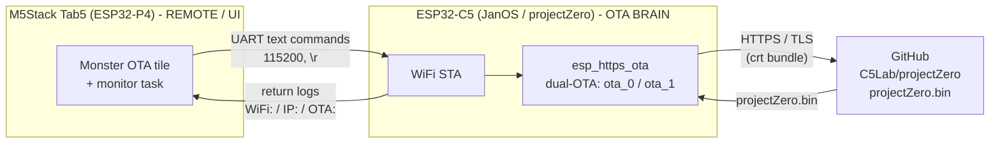
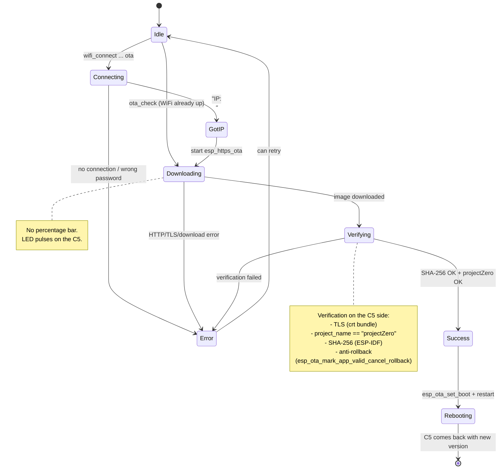

# Monster OTA

Documentation for the **Monster OTA** feature — remote firmware update of the ESP32-C5
module (firmware **JanOS** / **C5Lab/projectZero**, base version `1.6.8`) triggered from the
application running on the **M5Stack Tab5 (ESP32-P4)**.

## Summary

Monster OTA is a **self-OTA** mechanism. All update logic lives on the ESP32-C5 side: the C5
owns the WiFi, connects to the network itself, downloads the `.bin` from GitHub itself via
`esp_https_ota` (HTTPS/TLS), and reflashes its own inactive OTA partition itself
(dual-OTA layout: `ota_0` / `ota_1`).

**The Tab5 / ESP32-P4 acts purely as a remote (UI + transport):**

- it sends text commands over UART (115200 baud, each line terminated with `\r\n`) to the tab
  where the C5 module was detected,
- it parses the returned log lines (prefixes `WiFi:`, `IP:`, `OTA:`, etc.) and shows them in the UI.

The P4 does **not** flash the C5, does **not** implement esptool, does **not** touch the
`EN`/`BOOT` pins, and does **not** even know the firmware file URL. The source address is
compiled into the C5 firmware:

- `OTA_GITHUB_OWNER` = `C5Lab`
- `OTA_GITHUB_REPO` = `projectZero`
- asset = `projectZero.bin`
- `dev` channel = raw file from the `development` branch:
  `https://raw.githubusercontent.com/C5Lab/projectZero/development/ESP32C5/binaries-esp32c5/projectZero.bin`

## Architecture



The UART transport is chosen based on how the C5 is wired to the tab:

| Connection | Pins | UART port |
|---|---|---|
| Grove | GPIO53 / GPIO54 | `UART_NUM` (default for the tab) |
| USB | — | `UART_NUM` (default for the tab) |
| MBus | GPIO37 / GPIO38 | `UART2_NUM` (when `uart2_initialized`) |

On the P4 side the port is selected by the helper `uart_port_for_tab(tab)`, and bytes are sent
with `transport_write_bytes_tab(tab, port, data, len)`.

## User flow

```mermaid
flowchart TD
    Tile["'Monster OTA' tile in Settings"] --> Setup["Setup screen:<br/>'Monster OTA'"]

    Setup --> Opt{Option select}

    Opt -->|"Scan"| Scan["scan_networks<br/>pick SSID<br/>show_pass evil"] --> Setup
    Opt -->|"Download & Flash"| Valid{"P4 validation:<br/>SSID required,<br/>Manual: IP/NM/GW"}
    Opt -->|"SSID"| KbSsid["Keyboard: SSID"] --> Setup
    Opt -->|"Pass"| KbPass["Keyboard: password<br/>(show/hide)"] --> Setup
    Opt -->|"Mode DHCP/Manual"| Mode["Toggle mode<br/>(Manual: IP/Netmask/GW/DNS)"] --> Setup
    Opt -->|"Channel main/dev"| Chan["Send: ota_channel main|dev"] --> Setup
    Opt -->|"List updates"| ValidList{"P4 validation:<br/>SSID required,<br/>Manual: IP/NM/GW"}
    Opt -->|"Show info"| SendInfo["Send: ota_info"] --> InfoScr["OTA Info screen<br/>boot/running/next + APP[n]<br/>Activate inactive slot"]

    Valid -->|"OK"| SendWC["Send:<br/>wifi_connect \"SSID\" \"PASS\" ota [ip nm gw dns]<br/>or --saved ota"]
    Valid -->|"Error"| Setup
    ValidList -->|"OK"| SendWL["Send:<br/>wifi_connect \"SSID\" \"PASS\" [ip nm gw dns]<br/>or --saved"]
    ValidList -->|"Error"| Setup

    SendWC --> Status["OTA Status screen<br/>WiFi / IP / OTA"]
    SendWL --> ListStatus["OTA List status<br/>WiFi -> Releases -> Ready"]
    ListStatus -->|"IP received"| SendList["Send: ota_list"]
    SendList -->|"OTA[n]"| ListStatus
    InfoScr --> Setup
```

The **Setup ("Monster OTA")** screen on Tab5 — form plus action buttons:

1. **Scan** — sends `scan_networks`, lets the user pick an SSID, then checks `eviltwin.txt`
   with `show_pass evil`. If a password exists, the update flow uses `--saved`.
2. **SSID: `<...>`** — on-screen keyboard or selected from Scan.
3. **Pass: `******`** (show/hide) — on-screen keyboard; left empty when `--saved` is used.
4. **Mode: DHCP / Manual** — dropdown; in Manual mode the extra fields
   **IP / Netmask / GW / DNS** appear (each edited separately via the keyboard).
5. **Channel: main / dev** — dropdown; sends `ota_channel <main|dev>`.
6. **Download & Flash** — builds `wifi_connect ... ota` and starts the C5 self-OTA
   immediately after WiFi connects.
7. **List** — connects WiFi with the selected SSID/password first, then sends `ota_list` after
   the C5 reports an IP. It uses the same saved-password and manual-IP handling as update.
8. **Info** — sends `ota_info`, opens the info screen. The inactive partition row has
   **Activate**, which sends `ota_boot <ota_0|ota_1>` and reboots the C5.

The connect/update behavior:

- After validation the app builds and sends `wifi_connect "SSID" "PASS" ota [ip nm gw dns]`.
  If the selected network has a saved Evil Twin password on the C5, the UI sends
  `wifi_connect "SSID" --saved ota [...]` instead. The C5 joins the network and
  **automatically** starts OTA once it gets an IP.
- `List` is separate and informational. It opens a status-style monitor, connects WiFi without
  the `ota` flag, then sends `ota_list` after IP is assigned.

## OTA state diagram

The states are read by the P4 from the C5's return logs and mapped to the decorated Status
screen: WiFi -> Release -> Download -> Flash.



## UART command reference (P4 -> C5)

Every command is plain ASCII text, terminated with `\r\n`, sent at 115200 baud.

| Action | Command | Responses (prefixes to parse) |
|---|---|---|
| Connect WiFi + start OTA | `wifi_connect "SSID" "PASS" ota [IP NETMASK GW [DNS]]` | `WiFi: <ssid>`, `IP: ...`, `OTA: ...` |
| Connect using saved password | `wifi_connect "SSID" --saved [ota] [IP NETMASK GW [DNS]]` | `wifi_connect: using saved password...`, `WiFi: ...`, `IP: ...` |
| Check for update (WiFi already up) | `ota_check [latest\|<tag>]` | `OTA: ...` |
| Set channel | `ota_channel <main\|dev>` | `OTA channel: ...` |
| List releases | `ota_list` | `OTA[n]: <tag> (main\|dev) <date> <title>` (up to 5) |
| Partition info | `ota_info` | `OTA boot:` / `OTA running:` / `OTA next:` / `APP[n]:` |
| Manual boot-slot select | `ota_boot <ota_0\|ota_1>` | confirmation + C5 restart |

### Examples of literal strings sent over UART

```text
wifi_connect "HomeNet" "s3cr3t!" ota\r\n
wifi_connect "OfficeAP" "pass word" ota 192.168.1.50 255.255.255.0 192.168.1.1 8.8.8.8\r\n
ota_check\r\n
ota_check latest\r\n
ota_check v1.6.8\r\n
ota_channel dev\r\n
ota_channel main\r\n
ota_list\r\n
ota_info\r\n
ota_boot ota_0\r\n
ota_boot ota_1\r\n
```

Syntax notes:

- SSID and password are **quoted** — this allows spaces in both fields.
- The `ota` keyword after the password is a flag telling the C5 to auto-start OTA once connected.
- Static params (`IP NETMASK GW [DNS]`) are optional — supplied only in Manual mode; DNS is
  optional even in Manual mode.

### P4-side validation (before sending)

- **SSID** — required (an empty SSID blocks sending `wifi_connect`).
- **Manual** mode — **IP / Netmask / GW** required (DNS optional).
- Command too long (buffer exceeded) — error, not sent.

## Return-log prefixes (C5 -> P4)

The Status screen and the List/Info screens are built by parsing the start of each UART line:

| Prefix | Meaning | Screen |
|---|---|---|
| `WiFi: <ssid>` | Connecting / WiFi connection status | Status (line 1) |
| `IP: <address>` | IP address obtained (moving to download phase) | Status (line 2) |
| `OTA: <...>` | OTA progress/result: start, download, success or error | Status (line 3) |
| `OTA channel: <main\|dev>` | Channel setting confirmation | (after `ota_channel`) |
| `OTA[n]: <tag> (main\|dev) <date> <title>` | Release list entry (up to 5) | OTA List |
| `OTA boot:` | Partition set as bootable | OTA Info |
| `OTA running:` | Currently running partition | OTA Info |
| `OTA next:` | Partition that the next OTA will write to | OTA Info |
| `APP[n]:` | Application slot: version / offset / state (valid / pending) | OTA Info |

The **OTA Status** screen shows a large phase card, step labels, WiFi/IP/OTA summary lines, and
the raw UART log. The main update flow starts with `wifi_connect ... ota`; after WiFi connects,
JanOS downloads and flashes on the C5 side. If UART becomes quiet after flash progress, the UI
shows a busy/finalizing wait state. Silence is not treated as success: the close button remains
disabled until an explicit terminal line is received.

For an installation, the UI state transitions are intentionally strict:

- `OTA: download complete (...)` means only that all bytes arrived; the UI shows `Finalizing OTA`
  at 92% and continues waiting;
- a quiet UART after byte progress shows `C5 is still finalizing` at 96%; it never enables `Done`;
- generic `restart` or `reboot` text is informational and is not a success marker;
- only `OTA: update applied, restarting` confirms that the image was finished and the boot slot
  was switched; this moves progress to 100% and enables `Done - Close`;
- `no update` / `up to date` remains a valid terminal result because no flash operation is needed.

The **OTA List** screen — up to 5 `OTA[n]:` lines with the latest releases.

The **OTA Info** screen — two large partition rows with state (`boot` / `running` / `next`),
`APP[n]` details (versions, offsets, `valid` / `pending` state), and an **Activate** button only
on the currently inactive partition.

## Behavior and edge cases

- **Muting other pollers.** During OTA the C5 floods the UART with logs. Other tasks polling the
  same tab (observer / scan) must be paused for the duration of OTA — the `ota_monitoring` flag,
  modeled on the existing `handshaker_monitoring` (see also `ctx->global_handshaker_monitoring`).
- **Restart after success.** After a successful OTA the C5 **restarts**: it disappears from the
  UART for a few seconds and comes back with the new version. The UI should treat this as a
  `rebooting...` state only after the explicit `OTA: update applied, restarting` marker and,
  once the module returns, re-detect the version via
  `check_version_for_tab(tab)`.
- **Port selection on MBus.** When the C5 is connected over MBus, `uart_port_for_tab` returns
  `UART2_NUM` (as long as `uart2_initialized`); otherwise `UART_NUM`.
- **"Update available" badge.** The app already knows the module version (`janos_version`) and the
  `janos_version_mismatch` flag against `JANOS_VERSION_REQUIRED` (`"1.6.8"`) — this can be used to
  show an update-available indicator even before entering Monster OTA.
- **Image verification (on the C5 side).** TLS with crt bundle, a `project_name == "projectZero"`
  check, a SHA-256 computed by ESP-IDF, and anti-rollback
  (`esp_ota_mark_app_valid_cancel_rollback`) — all done by the C5; the P4 only watches the logs.
- **`dev` channel.** Skips version comparison — the image from the `development` branch is always
  flashed (useful for testing, no "already up to date" block).
- **No-`wifi_connect` path.** If WiFi is already connected on the C5, `ota_check` is enough to
  trigger the check/update without re-joining the network.

## Implementation in Tab5

Monster OTA on the P4 side consists of:

- A **tile in Settings** opening the Setup screen ("Monster OTA") and the related screens
  (Confirm, Status, List, Info) described above.
- A **monitor task** running against the selected C5 tab — it reads lines from the correct UART
  port (`uart_port_for_tab`), recognizes the prefixes (`WiFi:` / `IP:` / `OTA:` / `OTA[n]:` /
  `OTA boot:` etc.) and updates the screen state. For the duration of OTA it sets the
  `ota_monitoring` flag so it does not collide with other pollers.
- A **thin transport** — building the command strings and sending them via
  `transport_write_bytes_tab(tab, uart_port_for_tab(tab), cmd, len)` with `\r\n` appended.

All OTA logic (WiFi, HTTPS, verification, partition write, reboot, anti-rollback) stays
**entirely on the C5 / JanOS side**. The P4 contains no flashing logic — it is a remote and a
status display.
