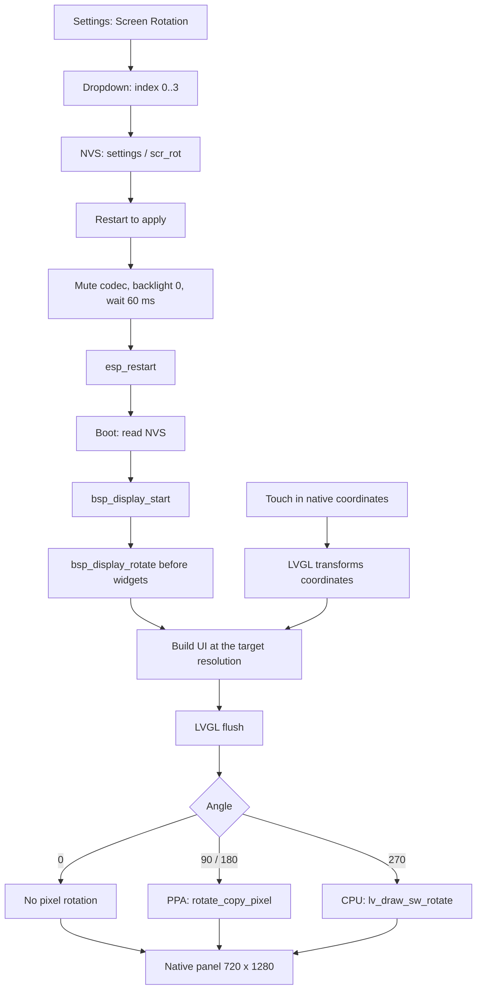
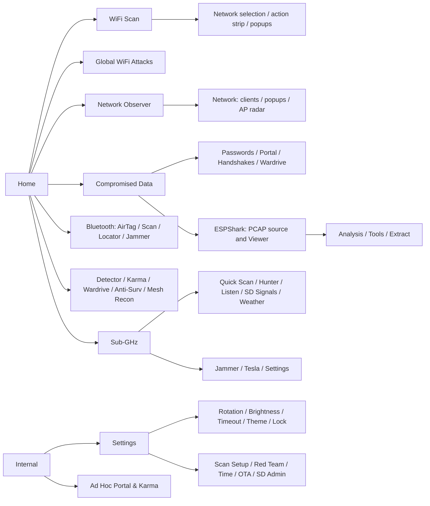

# Screen rotation and UI map - 2026-09-08

## Checks performed on the host

| Check | Result | Scope |
|---|---|---|
| `main/main.c` | PASS | Object compilation using flags from `build/compile_commands.json`, output in the temporary directory |
| `esp_lvgl_port_disp.c` | PASS | Same as above; this is not a full firmware link |
| `run_rotation_geometry_tests.py` | PASS | 3,686,400 points and 16 rectangles, 0/90/180/270, ASan + UBSan |
| `cgw_parser_test.c` | PASS | Parser tests, ASan + UBSan |
| `boot_melody_osc_test.c` | PASS | Tone generator and envelope; no hardware listening test |
| `pcap_summary_reducers_test.c` | PASS | Reducers, ASan + UBSan |
| `pcap_summary_report_test.c` | PASS | End-to-end reports, ASan + UBSan |
| `run_uart_transfer_tests.py` | BLOCKED | The harness does not compile against the current code |
| COM24, 115200 | Port opened | No data for 8 seconds; no reset requested |
| Pass B: display / touch / PPA | UNVERIFIED | Requires observation on the device |

Run the new test: `wsl -e python3 /mnt/c/Users/mati/Documents/GitHub/M5MonsterC5-Tab5/tests/run_rotation_geometry_tests.py`.
Other commands: [tests/README.md](../tests/README.md).

The geometry test extracts the current `lvgl_port_rotate_area()` function from the
production C file, compiles it, and checks every panel pixel, transform invertibility,
and non-square rectangles. It does not execute `rotate_copy_pixel()`, MIPI transfers,
or touch input. These results cannot be used to mark the 180-degree PPA test as passed.

The UART harness now omits `janos_uart_download_attempt()`, does not define
`ESP_ERR_NOT_FINISHED`, and provides no host equivalent of `esp_rom_crc32_le()`.
The result is a test compilation failure, not a transfer test result. Firmware was not modified.

## Findings concerning Screen_Rotation.md

- Boot applies the saved rotation after `bsp_display_start()`, before creating the UI.
- The code confirms PPA for 90/180 and CPU for 270.
- `popup_clamp_h()` allows 1110 px in portrait and **550 px in landscape**:
  display height minus 130 px for the header/tabs minus a 40 px margin.
  The landscape container is 590 px tall. Older tables using 680 px and margins
  measured against the entire display do not establish that a popup fits this container.
- The comment near `app_main()` still says that only 90 degrees uses PPA; the driver
  code and the main document description are newer than that comment.
- Screenshots are enabled (`SCREENSHOT_ENABLED true`), with output in `/sdcard/SCREENS`.

## How rotation works

## Main navigation map

This map groups the paths described in Pass C; it does not show every state or callback.
Direct references for individual functions are available in the atlas.

## Available graphics

The [LVGL render gallery](ui-render/README.md) now contains actual host-rendered UI
images for 98 named cases in all four orientations, including Sub-GHz pages.
The [navigation flow maps](ui-render/flow/README.md) document 108 source-backed routes.
These supersede the earlier source-diagram atlas, which did not show screen appearance.

The renderer uses production UI builders, repository fonts and styles, synthetic data,
and inert hardware adapters. It captures the complete LVGL flush output, including top
layers. Logical screenshots and expected native-panel placement images are provided.
This does not test PPA output or physical touch, and does not cover every asynchronous
state or loaded PCAP analysis. Detailed coverage and substitutions are in the gallery.

Hardware screenshots remain available by tapping the LAB5 logo and collecting
`/SCREENS/scr_*.bmp` from the SD card. They are still needed alongside visual inspection
of the physical panel for the hardware rotation smoke test.

## Pass B - hardware observation checklist

Opening views, scrolling, and closing popups is sufficient for layout checks; radio
actions need not be started for this purpose. Session-dependent data requires existing state.

| Orientation | What to check | Result |
|---|---|---|
| 0 degrees | Home, Settings, Scan; stacked metadata; strip scrolling; Observer and Deauth Station | pending |
| 90 degrees | Home/Settings; single-line metadata; visible CLOSE and Observer bottom strip | pending |
| 180 degrees | No image corruption; touch at corners and center; small updates while scrolling | pending |
| 270 degrees | Display, touch, and scrolling smoothness on the CPU path | pending |
| Restart / cold boot | Short chime after restart; melody after cold boot; Boot sound OFF respected | pending |

Use Restart after each orientation change. Do not change touch mapping in the BSP.
When finished, return to 0 degrees and repeat the Pass C views for the Pass E regression check.
