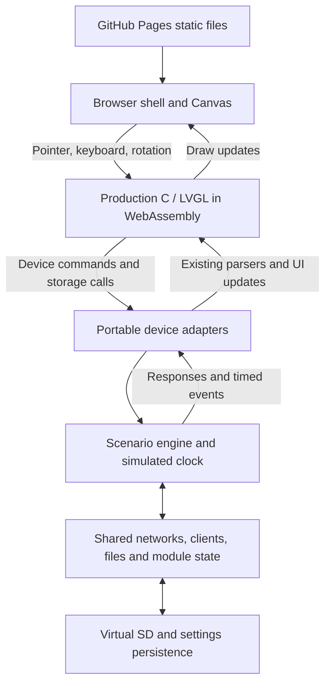

# Live Web Emulator Plan

**Status:** Proposed architecture and delivery plan. Implementation and deployment have not started.

**Progress tracker:** [Live Emulator TODO and Progress](../../Live_Emulator_TODO.md). Use the tracker for current completion status and next actions.

**Scope amendment:** [Accepted decisions](../../ui-emulator/Accepted_Decisions.md) take precedence over the original full-application outline below: SubGHz is deferred; demo timing is shortened with a realistic option; required virtual modules are available by default. SubGHz references below describe a later stage, not current acceptance requirements.

**Goal:** Run the Monster touchscreen interface interactively in a browser, with coherent simulated device data across its workflows, hosted under the existing GitHub Pages site.

**Architecture:** Compile the production C/LVGL interface to WebAssembly using Emscripten. Connect its hardware boundaries to a deterministic simulated device. A small browser shell provides display scaling, input, rotation, scenario selection, and reset.

**Tech stack:** Repository LVGL and fonts, C, CMake, Emscripten, JavaScript, Canvas, JSON fixtures, browser storage, Playwright, GitHub Actions and Pages. Pin the Emscripten version after the first compatibility build.

## 1. Starting point and limits

The existing export contains 98 named render cases in four rotations, producing 392 logical screen images. The flow documentation contains 108 source-anchored routes. These are useful starting inventories, not proof that every interactive state is covered.

Reusable assets:

- Production screen construction, widgets, fonts, styles, and applicable parsers.
- `tools/ui_render/` build research, hardware boundary inventory, and framebuffer capture.
- `docs/ui-render/` visual references and `docs/ui-render/flow/` navigation evidence.
- `tests/run_rotation_geometry_tests.py` coordinate transformation regression coverage.

The current renderer cannot simply be published as a live application. `tools/ui_render/prepare.py` rejects most functions ending in `_task`, `_cb`, or `_callback`. Its host adapters accept task creation without running tasks, and the entry point constructs one screen, captures it, and exits. Synthetic clocks advance on calls rather than elapsed time. These shortcuts must not become the live runtime.

## 2. Intended user experience

A visitor opens `/emulator/`, sees the Monster interface, and can navigate, scroll, type, open dialogs, change settings, and run simulated workflows. The default scenario starts with connected virtual modules and populated data. Empty and failure conditions are selectable scenarios.

The surrounding page provides rotation (0, 90, 180, 270 degrees), fit-to-window, full screen, scenario selection, and reset. A visible Demo indicator explains the simulated device state. An optional flow panel can show the current route and its next actions after core behavior is complete.

For example: scan networks, select a network, inspect its clients, start a simulated capture, watch counters increase, stop it, find the saved file on the virtual SD card, and open its analysis. The network, clients, counters, and file contents must agree throughout this sequence.

This is an emulator of the application experience. ESP32 instruction execution, physical RF behavior, PPA performance, and hardware touch correctness remain outside its scope. It needs no connected Tab5, COM port, API key, or application server.

## 3. Architecture

### Shared interface code

Keep the production screen code and the exact repository LVGL version. Use the official LVGL Emscripten port as a reference for browser integration. Avoid maintaining a second interface implementation in HTML.

Replace heuristic callback removal with an explicit inventory of retained UI functions and substituted device operations. Unknown dependencies must fail the build or coverage gate. Extract shared UI units incrementally from `main/main.c` where needed; avoid a wholesale firmware refactor. Any extraction must retain an ESP-IDF build check and screenshot comparison.

### Browser runtime and input

Use a single-threaded browser event loop that advances LVGL from elapsed monotonic time, processes scheduled simulated events, and returns control to the browser. Convert blocking device operations into bounded asynchronous jobs. Do not emulate FreeRTOS by leaving delays empty or running endless task loops on the browser thread.

The display adapter presents LVGL output on Canvas. Translate pointer coordinates through CSS scaling and orientation exactly once. Keep the device's logical resolution separate from the browser's CSS size and pixel density. Verify scrolling, press/release, dragging, text entry, and pointer cancellation outside the canvas.

Prefer a build without pthreads. Emscripten pthreads require shared-memory browser support and COOP/COEP headers; avoiding this dependency simplifies static hosting.

### Simulated device and asynchronous behavior

Use a portable scenario engine with a seeded state model and scheduled events. Keep scenario data separate from UI code. Where practical, simulated UART replies should pass through the same parsers as real replies.

Every running operation has an identity, start time, progress state, completion result, and cancellation state. Cancelled or superseded jobs cannot update a later screen. Navigation must not leave callbacks referencing deleted LVGL objects. Module disconnect, timeout, and restart must have explicit outcomes.

Keep consistent identifiers across screens: a network has the same BSSID, channel, clients, history, and associated files wherever it appears. Variation in RSSI or counters follows a deterministic timeline rather than independent random values per screen.

### Virtual files and settings

Use an in-memory filesystem for the virtual SD card and preload small synthetic files, including valid PCAP fixtures. Reuse the actual analysis code where portable, so displayed analysis derives from file contents.

Persist settings through a browser adapter; optionally persist SD changes through IndexedDB-backed storage. Emscripten MEMFS is transient and IDBFS requires explicit synchronization. Initialize storage before mounting the UI, handle unavailable storage with a working session-only mode, and version stored data. Reset restores the selected scenario; simulated reboot retains settings while rebuilding runtime state.

## 4. Data and behavior coverage

| Area | Default populated scenario | Additional behavior to exercise |
| --- | --- | --- |
| Home and modules | Connected Grove/MBus modules, SD, clock and battery | Disconnect/reconnect, unavailable module, status changes |
| Wi-Fi scanning | Several networks, channels, security types and signal levels | Scan progress, rescan, empty results, timeout |
| Observer and clients | Clients linked to the same scanned networks | Selection, changing counters, discovery and removal |
| Operation screens | Simulated progress, logs and outcomes | Start, stop, cancel, failure, result files |
| Files and PCAP | Valid synthetic captures, folders and reports | Open, analyze, rename/delete where supported, invalid file, full SD |
| Wardrive and GPS | Synthetic route, fix, speed and discovered networks | No fix, pause/resume, saved session, simulated upload outcome |
| Bluetooth | Devices with coherent names, addresses and RSSI | Scan, detail, empty state and disconnect |
| SubGHz | Virtual module, sample signals and saved recordings | Receive/progress/stop, save/load and simulated transmit feedback |
| Settings and internal tools | Seeded settings, module information and diagnostics | Persist changes, rotation, reboot and reset |
| Other exposed functions | Fixtures discovered through the interaction inventory | Every visible control mapped to a defined response |

The coverage ledger must list screens, dialogs, controls, preconditions, routes, asynchronous states, and expected side effects. A populated screenshot alone does not close an item. Simulated RF and upload operations only change local scenario state.

## 5. Proposed file ownership

These paths are proposed implementation locations, not existing deliverables.

| Path | Responsibility |
| --- | --- |
| `tools/ui_emulator/CMakeLists.txt` | Native and WebAssembly simulator build targets |
| `tools/ui_emulator/Dockerfile` | Pinned reproducible build toolchain |
| `tools/ui_emulator/runtime/` | Main loop, display/input adapters, simulated clock and lifecycle |
| `tools/ui_emulator/device/` | Scenario model, device command adapters and virtual storage |
| `tools/ui_emulator/scenarios/` | Versioned fixture data and synthetic files |
| `tools/ui_emulator/web/` | Browser shell, loading/error UI and persistence bridge |
| `tools/ui_emulator/coverage.json` | Explicit interaction and adapter coverage ledger |
| `tests/ui_emulator/` | Scenario, lifecycle, navigation and visual regression tests |
| `main/main.c` and extracted shared UI units | Minimal changes needed to share real callbacks and isolate hardware |
| `docs/emulator/` | Generated static publishing output |
| `.github/workflows/pages-only.yml` | Assemble emulator with the existing site before publishing |
| `.github/workflows/esp32p4-build-master.yml` | Preserve the same emulator output during firmware-driven publishing |

## 6. Delivery sequence and acceptance gates

### Phase 1: Dependency inventory and feasibility slice

- [ ] Extend the existing screen/route inventory with event callbacks, task entry points, storage dependencies and global state lifetimes.
- [ ] Classify each dependency as shared UI, shared parser/model, or simulated device boundary.
- [ ] Compile Home, Settings and Scan to WebAssembly with actual navigation callbacks.
- [ ] Run scan progress, completion and cancellation through the browser event loop.
- [ ] Measure download size, startup time, frame time and memory use on a desktop browser and one mobile device before setting performance budgets.

**Gate:** Real clicks navigate and cancel a timed scan without freezing. The four rotations draw correctly and input hits the intended controls. No silent callback stubs remain in this slice.

### Phase 2: One complete stateful workflow

- [ ] Define a versioned default scenario with linked networks, clients and files.
- [ ] Implement simulated device command responses and deterministic event scheduling.
- [ ] Connect Scan -> network selection -> clients -> simulated capture -> virtual file -> PCAP analysis.
- [ ] Test completion, cancellation, repeated start, navigation during activity and delayed replies after cancellation.

**Gate:** The resulting file and analysis match the selected network and simulated operation. Reset reproduces the same starting state.

### Phase 3: Cover the remaining application

- [ ] Add Observer, remaining operation flows, Wardrive/GPS, Bluetooth, SubGHz, storage management and internal tools according to the ledger.
- [ ] Add populated, empty, disconnected, timeout and failure cases where applicable.
- [ ] Cover dialogs and callback-created screens missing from the static render inventory.
- [ ] Review every visible control for an implemented outcome and every back route for correct restoration.

**Gate:** All inventoried interactions have an expected behavior and evidence. Any unsupported behavior is explicit in the ledger and demo; it does not count as complete coverage.

### Phase 4: Persistence and browser experience

- [ ] Implement settings persistence, optional persistent virtual SD, simulated reboot and complete demo reset.
- [ ] Add the browser controls for orientation, scaling and scenario selection.
- [ ] Add loading progress, recoverable startup errors and a visible demo indicator.
- [ ] Test fresh storage, old schema, storage denial, reload, reboot and reset.

**Gate:** Settings survive the intended lifecycle, reset clears the intended state, and a storage failure does not prevent use.

### Phase 5: Regression and compatibility

- [ ] Run deterministic scenario tests against the portable engine.
- [ ] Use Playwright to exercise navigation, dialogs, controls and representative full workflows across all four rotations.
- [ ] Compare matching seeded UI states with the existing LVGL exports; review intentional differences such as live counters.
- [ ] Test pointer mapping at corners and central controls, scrolling and text input at multiple CSS sizes.
- [ ] Exercise repeated navigation, cancellation, scenario changes and restart to detect stale callbacks and accumulating memory.
- [ ] Test Chromium, Firefox and WebKit automation, plus real mobile touch on a supported device.
- [ ] Build firmware after any changes to shared production code and rerun relevant native regressions.

**Gate:** Functional checks pass, visual differences are explained, and measured performance meets the budgets established in Phase 1. Browser checks do not replace physical display/touch testing.

### Phase 6: GitHub Pages integration

- [ ] Build static HTML, JavaScript, WebAssembly and scenario assets into a staging directory.
- [ ] Assemble one Pages artifact containing the existing site, firmware manifest/assets and `/emulator/`.
- [ ] Make both publishing workflows use the same assembly process; coordinate deployments so an older build cannot overwrite a newer complete site.
- [ ] Extend workflow path triggers to include emulator source and its shared UI dependencies.
- [ ] Test under the repository URL prefix, including direct `/emulator/` navigation, relative asset URLs and missing assets.
- [ ] Verify the existing flasher remains functional and that both publishing paths retain the emulator.

**Gate:** A preview of the assembled static artifact loads without a backend and includes both the emulator and existing tools. Production publication is a later implementation action, outside this planning task.

The current Pages-only workflow resolves and downloads an existing firmware release before uploading `docs`. The emulator build and local preview should run independently of that release lookup; final site assembly must preserve the flasher's release requirements. Docker is needed only for reproducible development/CI builds, not by visitors.

## 7. Main risks and decisions

| Risk | Planned response |
| --- | --- |
| Hardware and UI code are tightly coupled | Validate one vertical slice first; extract shared boundaries incrementally |
| Broad no-op adapters conceal missing behavior | Explicit adapter registry and interaction coverage gates |
| Blocking tasks freeze the browser | Cooperative timed jobs with cancellation and bounded work |
| Dummy data contradicts itself across screens | One canonical seeded model and real synthetic files |
| Rotation looks right but touch is wrong | End-to-end input tests in every orientation and CSS scale |
| A later Pages deployment removes the emulator | Shared artifact assembly across both publishers |
| Native images hide browser performance problems | Measure the WASM prototype before committing to budgets |

Recommended first implementation milestone: Home + Settings + Scan with real input, all rotations, deterministic scan progress/results/cancellation, and a local static preview. Expand only after that proves the code-sharing and scheduling approach.

## 8. Existing manual stories and guided mode

The user supplied `docs/tab.stories/` as the reference for the existing manual documentation. Its landing page links to topic pages. Seven tutorial pages define 44 image-and-caption entries in JavaScript arrays and generate numbered timelines with click-to-zoom images. `middle-man.html` is an additional topic page with a different structure. The Bluetooth list image also provides a populated device-screen reference, including scrolling density and signal colors.

Use these stories as the initial editorial and workflow reference, and verify their steps against current production code. They may describe an earlier firmware state. Their screenshots are visual references; simulated fixtures should use synthetic identities rather than copying captured device addresses.

The emulator should support two experiences on the same running UI:

- **Explore:** freely navigate the application with coherent simulated device state.
- **Guided stories:** choose a topic, read a short instruction beside the live screen, perform the action, and advance when the expected application event/state occurs.

Preserve the existing topic organization: Bluetooth scan, global operations, C5 Karma, Network Observer/Karma, scan operations, compromised-data settings, WPA-SEC upload, and middle-man explanations. Treat the existing captions as draft tutorial content to review, not as executable behavior specifications.

Add proposed `tools/ui_emulator/stories/` definitions with a story ID, title, initial scenario, ordered steps, instruction text, expected UI event, completion condition, and flow-node reference. Use stable semantic screen/control IDs for highlighting and verification; do not hardcode screenshot pixel coordinates. A step completes only when its expected state is reached. Returning to a previous instruction must distinguish rereading it from resetting and replaying device state.

Use these same definitions to drive the guide, automated walkthrough tests, and story-specific flow diagrams. Optional generated screenshots should be captured from the running scenario at step boundaries, with all four rotations available. This keeps instructions, images, and behavior connected as firmware changes.

Update delivery scope:

- Phase 1 imports a story-to-current-route mapping into the coverage ledger.
- Phase 3 covers the story preconditions, branches, and outcomes as part of device simulation.
- Phase 4 delivers one complete guided Bluetooth walkthrough, then expands to the remaining reviewed stories.
- Phase 5 checks that guide completion follows application events, including wrong actions, back navigation, scenario reset, and rotation during a step.
- Phase 6 preserves the existing `/tab.stories/` pages and adds links between the manual guide and matching live stories.

Acceptance: a visitor can follow a reviewed story by operating the actual simulated interface, or leave guided mode and continue exploring. Story overlays must not intercept unrelated input or obscure the target control at narrow viewport sizes.

## 9. Sources

- [Official LVGL Emscripten port](https://github.com/lvgl/lv_web_emscripten): reference browser port and build integration.
- [Emscripten runtime environment](https://emscripten.org/docs/porting/emscripten-runtime-environment.html): browser event-loop constraints.
- [Emscripten pthreads](https://emscripten.org/docs/porting/pthreads.html): shared-memory and header requirements.
- [Emscripten filesystem API](https://emscripten.org/docs/api_reference/Filesystem-API.html): transient MEMFS and persistent IDBFS behavior.
- [GitHub Pages overview](https://docs.github.com/en/pages/getting-started-with-github-pages/what-is-github-pages): static site hosting.

Repository evidence: `tools/ui_render/prepare.py`, `host.h`, `entry.c`, and `CMakeLists.txt`; `docs/ui-render/README.md`; `docs/ui-render/flow/`; `.github/workflows/pages-only.yml`; `.github/workflows/esp32p4-build-master.yml`.
