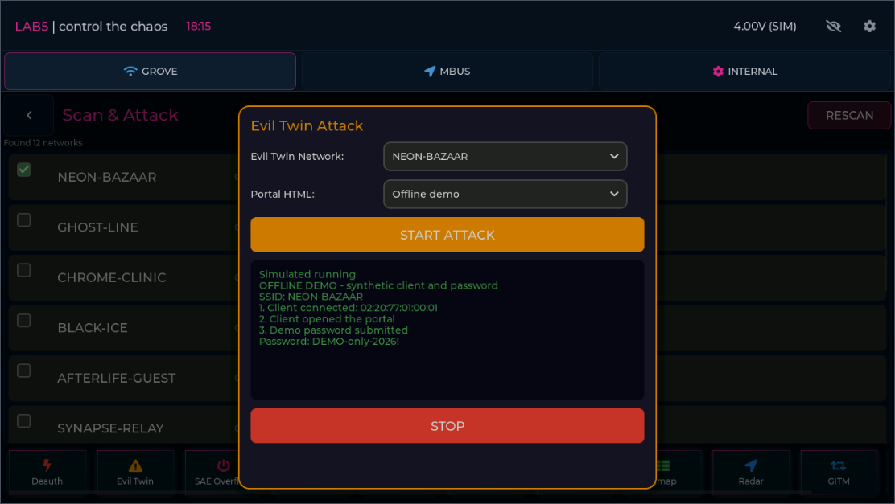
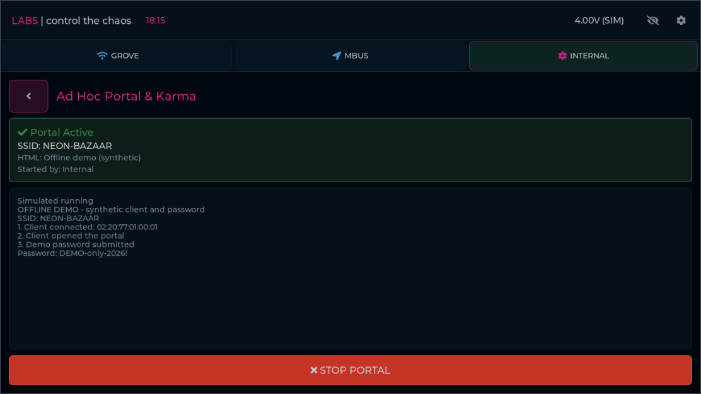

# Offline portal story — 2026-09-12

Evil Twin, Rogue AP and INTERNAL Ad Hoc Portal & Karma now demonstrate three
stages: a scenario client connects, opens the portal, and submits the fixed
synthetic password `DEMO-only-2026!`. The native activity area keeps the ordered
steps visible. At the default 10x speed stages appear after about 2/5/8 seconds;
realistic timing uses 20/50/80 seconds. A target without a matching scenario
client uses a story-only synthetic actor; all selected networks complete the demo. Stop, cancellation and disconnect freeze model progress.

The INTERNAL flow retains the native page, probe/network selector and template
selector. The selector uses scenario networks, not captured probe requests, and
offers one offline demo template. It runs on the scenario's existing internal
module independently of Grove and MBus. Back preserves the background operation;
STOP and shell Cancel end it, and Reset clears it. This is a demonstration of
client interaction, not full implementation of Karma2 or phishing portal screens.
No HTTP server, credential input, RF operation or password file is created.

## Verification

The build succeeded. Focused acceptance passed 17 cases: nine model/bridge cases,
three browser cases and five audit cases, in 16.34 seconds:
[run summary](test-runs/20260912-181529-e1ad9d/summary.json).
The browser cases exercise all three stories in four rotations, actual native
Start/Stop, cancellation before submission, restart and reset. No unavailable
events or page errors occurred. Model checks cover stage ordering, synthetic
values, module isolation, disconnect, stop and empty client scenarios.

Browser cases serve identical built Wasm bytes through Playwright to avoid
intermittent local HTTP transfer resets. No full cumulative regression PASS is
claimed for this build. The full Phase 5 settings gate includes this focused gate.

Exactly seven control templates changed from not-wired to covered. Current ledger:
338 covered (254 retained, 84 adapter), six unsupported, 108 not-wired out of 452;
12 open candidates, 96 deferred, zero uncategorized or uncovered back routes.
The remaining Karma2/phishing category contains 11 deferred controls.

Reviewed screenshots:





```powershell
./tools/ui_emulator/.venv/Scripts/python.exe tests/verify_emulator_portal_demo.py
```

## CHROME-CLINIC follow-up

The first version waited forever on networks without seeded clients. The user
reproduced this on CHROME-CLINIC. The story now supplies a synthetic actor when
needed, without changing discovered clients or writing files. Model tests cover
all 12 networks for all three operations, and a native browser regression repeats
Scan > CHROME-CLINIC > Evil Twin > Start through submission.

Rebuilt focused acceptance: **19 cases PASS** (10 model/bridge, four browser,
five audit), 20.12 s. [Summary](test-runs/20260912-183505-a6075b/summary.json).
