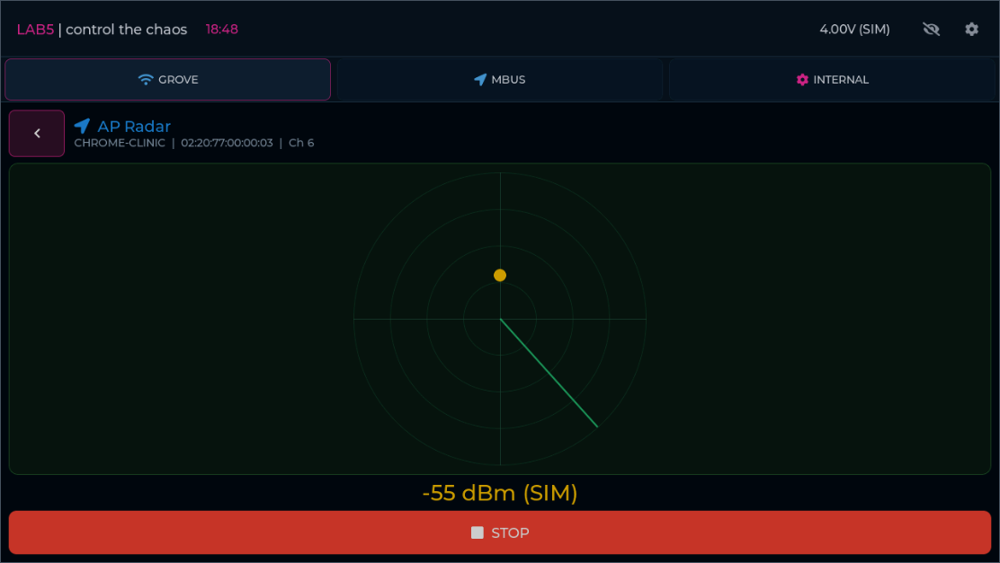

# AP Radar — 2026-09-12

Scan > select exactly one network > Radar now opens an offline AP locator.
The adapter preserves the native radar drawing and screen structure, with per-tab
state replacing firmware globals. It shows SSID, BSSID, channel, rotating sweep
and changing synthetic RSSI. The panel can shrink to fit landscape layouts.
Signal strength controls marker radius and color; no real bearing or distance is
measured. No radio commands or capture files are produced.

Each radar job reserves its own scenario module. STOP and Back complete the job
and return to Scan. Cancel/disconnect/reset stop samples; a disconnected or
cancelled page shows No signal. Grove and MBus remain independent. Reopening
creates fresh page state, and page deletion cancels its job.

Implementation: `runtime/radar.c`, `slice-phase5-radar.json`, attack routing and
the shared offline model. Sweep timing uses normal UI elapsed time; RSSI follows
the model's selected timing mode. Native callbacks keep their frozen binding IDs.

## Acceptance

Build succeeded. Focused gate: **17 cases PASS** (nine model/bridge, three browser,
five audit) in 19.14 s. [Summary](test-runs/20260912-184845-e05daa/summary.json).
Browser checks cover four rotations, target identity, RSSI updates during normal
wall-clock execution, STOP/Back/reopen, invalid selection, busy rejection,
disconnect, cancellation, module isolation and reset. No page errors or unavailable
events occurred. The screenshot was inspected for layout and native drawing.



Browser tests serve identical built Wasm bytes via Playwright to avoid intermittent
local HTTP transfer resets. Full cumulative, hardware and cross-browser acceptance
are not claimed by this focused run.

Exactly three Radar control templates moved to covered. The obsolete detector
deferral rule was removed. Ledger: 341 covered (254 retained, 87 adapters), six
unsupported and 105 not-wired out of 452; 12 open candidates, 93 deferred, zero
uncategorized controls or uncovered back routes.

```powershell
./tools/ui_emulator/.venv/Scripts/python.exe tests/verify_emulator_radar.py
```

The full `verify_emulator_phase5_settings.py` gate includes this follow-up.
